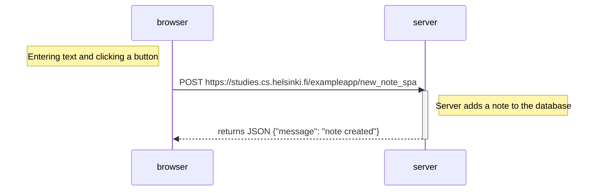

```mermaid
sequenceDiagram
    participant browser
    participant server

    Note left of browser: Entering text and clicking a button
    browser->>server: POST https://studies.cs.helsinki.fi/exampleapp/new_note_spa
    activate server
    Note right of server: Server adds a note to the database
    server-->>browser: returns JSON {"message": "note created"}
    deactivate server
```
